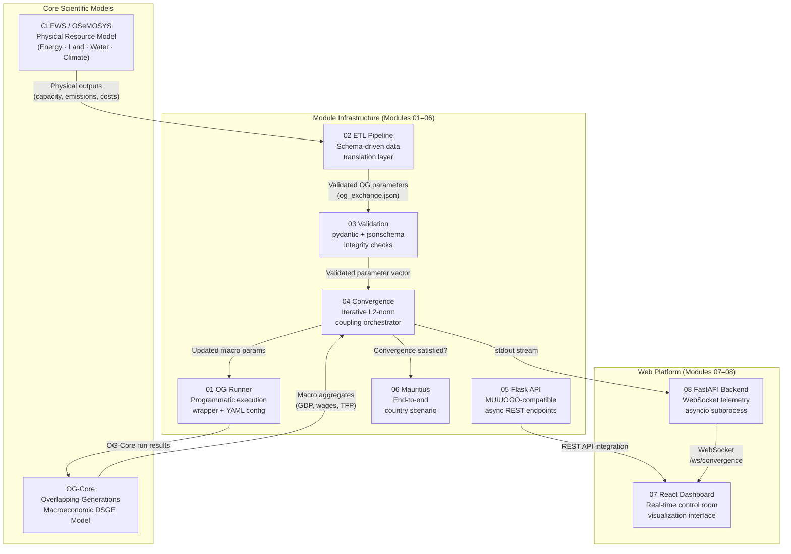
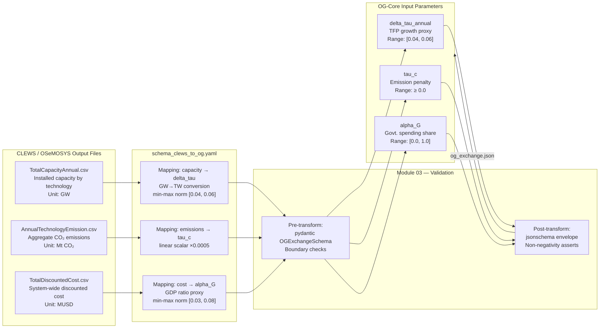
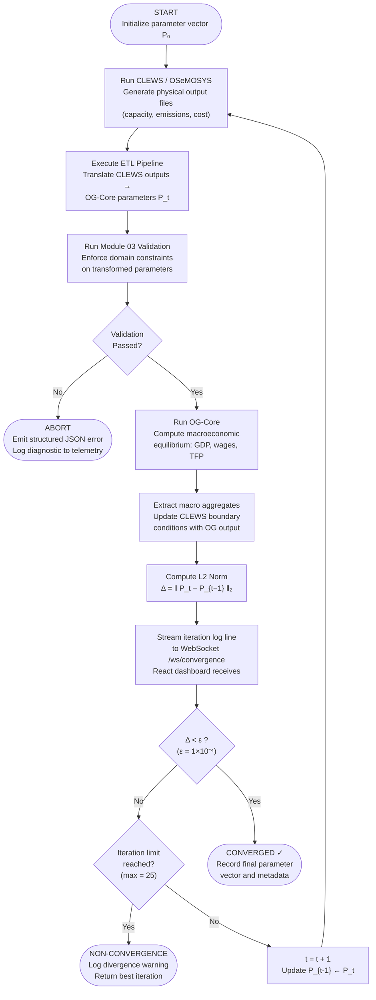
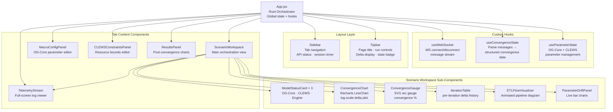
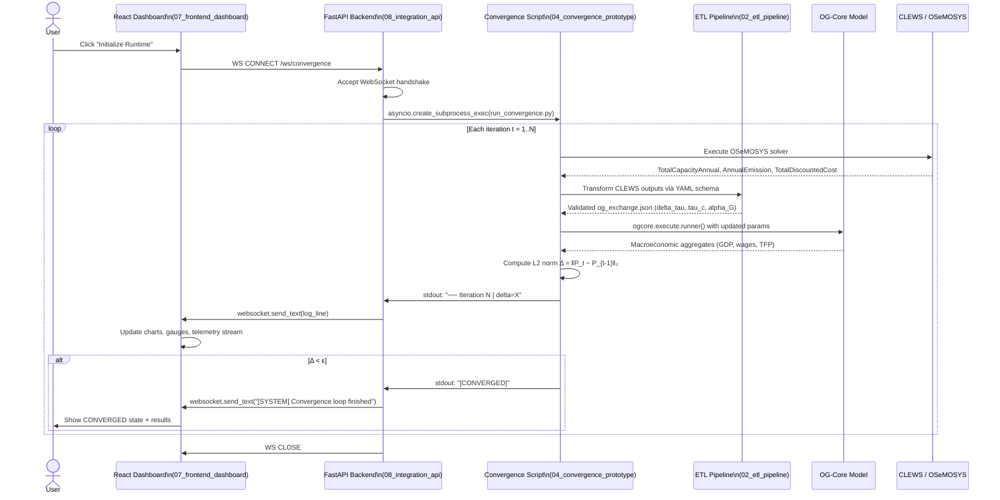
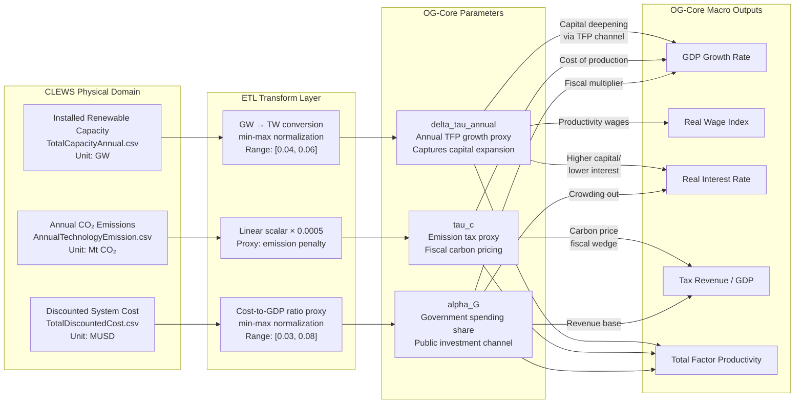

# OG-CLEWS Integration Framework: System Architecture and Technical Reference

**Scientific Programming and Model Integration**
United Nations Office of Information and Communications Technology (UN OICT)
Economic Analysis and Policy Division (UN DESA)

This document presents the architectural design, technical specifications, and prototype implementations constituting the OG-CLEWS integration framework. The repository comprises eight discrete, independently executable modules spanning scientific programming, cross-model data orchestration, schema validation, iterative convergence mechanics, REST and WebSocket API infrastructure, and real-time visualization.

Each module was developed under a rigorous research methodology to establish a deep technical understanding of both the physical resource modeling and macroeconomic equilibrium frameworks prior to production integration.

---

## 1. The OG-CLEWS Analytical Paradigm

The OG-CLEWS architecture seeks to integrate two mature, widely utilized open-source policy modeling frameworks that currently operate in isolation:

**CLEWS (Climate, Land, Energy, Water Systems)**, structured upon the **OSeMOSYS (Open Source Energy Modelling System)** framework, simulates the physical interdependencies among land use, energy infrastructure, and water resources under various climate scenarios. It addresses resource constraints and physical feasibility, such as the systemic impacts of varied precipitation levels on energy generation and land utilization.

**OG-Core** is an overlapping-generations macroeconomic model designed for dynamic general equilibrium analysis of fiscal, demographic, and economic policies over extended horizons. It quantifies long-term trajectories of macroeconomic aggregates, including gross domestic product (GDP), wage indices, capital deepening, and interest rates resulting from policy shocks.

Currently, these models lack a structural nexus. The OG-CLEWS framework establishes a standardized, automated data exchange layer, a shared execution orchestrator, and a unified telemetry interface. This synthesis enables robust, multidimensional policy analyses that reconcile physical resource constraints with macroeconomic equilibrium.

This integration is slated for deployment across multiple target nations through a multi-million-dollar program extending to 2030, with a primary focus on Small Island Developing States, Land-Locked Developing Countries, and Least Developed Countries, providing them with critical, open-source institutional modeling infrastructure.

---

## 2. System Architecture and Repository Structure

The repository is modularized into the following functional components:

```text
ogclews-prep/
├── 01_og_runner/                [Complete] Standalone programmatic OG-Core execution module
├── 02_etl_pipeline/             [Complete] CLEWS to OG-Core schema-driven data exchange pipeline
├── 03_validation_framework/     [Complete] Pre- and post-execution schema validation checks
├── 04_convergence_prototype/    [Complete] Iterative coupled model convergence orchestrator
├── 05_ogcore_api/               [Complete] Flask-based API endpoints for MUIOGO backend integration
├── 06_country_scenario/         [Complete] Comprehensive end-to-end analytical scenario (Mauritius)
├── 07_frontend_dashboard/       [Complete] React-based real-time control room and visualization interface
├── 08_integration_api/          [Complete] FastAPI backend with WebSocket telemetry for convergence streaming
└── README.md                    [Current Document]
```

---

### Diagram 1 — High-Level System Architecture

The following diagram illustrates the macro-level interaction between all eight repository modules, the two external models, and the web-based control room interface.



---

## 3. Project Modules

| Module ID | Module Designation | Status | Technical Description |
|---|---|---|---|
| 01 | OG-Core Runner | [Complete] | Standalone programmatic execution layer with structured logging and metadata capture. |
| 02 | ETL Pipeline | [Complete] | Declarative, schema-driven data translation pipeline incorporating rigorous data validation. |
| 03 | Validation Framework | [Complete] | Comprehensive schema validation infrastructure yielding structured UI-compatible error diagnostics. |
| 04 | Convergence Prototype | [Complete] | Iterative coupling algorithm utilizing L2 norm metrics for stable equilibrium identification. |
| 05 | Flask API Endpoints | [Complete] | Extension of the existing MUIOGO Flask architecture to support asynchronous OG-Core execution. |
| 06 | Country Scenario | [Complete] | End-to-end implementation utilizing data from the Republic of Mauritius, demonstrating macro-resource interactions. |
| 07 | Frontend Dashboard | [Complete] | React and Vite-powered user interface for real-time orchestration and visualization of model convergence. |
| 08 | Integration API | [Complete] | FastAPI service featuring WebSocket integration for low-latency streaming of convergence execution logs. |

---

## 01 — OG-Core Execution Runner

**Directory:** `01_og_runner/`

The execution runner isolates the OG-Core model, enabling programmable execution independent of its native UI. This ensures the model can be securely invoked within the broader automated orchestration pipeline.

### Functional Specifications

- Processes structured `YAML` configuration matrices to dictate scenario parameters and output trajectories.
- Interfaces programmatically with OG-Core via `ogcore.execute.runner()` and `p.update_specifications()`.
- Implements comprehensive stream capture for standard output and standard error, routing diagnostics to centralized logs.
- Generates a `metadata.json` ledger recording parameter states, execution timestamps, and deterministic file paths to ensure strict auditability and reproducibility.

### Structural Architecture

```text
01_og_runner/
├── runner/
│   ├── config_loader.py     [Component] Parses YAML configuration matrices
│   └── og_runner.py         [Component] Programmatic execution wrapper
├── configs/
│   └── sample_config.yaml   [Artifact] Representative scenario configuration
├── outputs/                 [Directory] Generated automatically upon execution
└── run_og.py                [Execution] Command-line interface entry point
```

---

### Diagram 2 — ETL Data Flow: CLEWS → OG-Core

This pipeline diagram traces the precise data lineage from raw OSeMOSYS solver output files to the validated OG-Core parameter vector consumed by the macroeconomic model.



---

## 02 — Extract, Transform, Load (ETL) Pipeline

**Directory:** `02_etl_pipeline/`

This pipeline forms the intellectual core of the cross-model data exchange, facilitating the translation of physical output metrics from CLEWS into macroeconomic parameters ingestible by OG-Core.

### Functional Specifications

- Ingests CLEWS/OSeMOSYS outputs, specifically capacity aggregates, emission trajectories, and system cost structures.
- Executes filtering, aggregation, and geometric transformations based strictly on a **declarative YAML schema**, ensuring high modularity and eliminating hardcoded logic.
- Conducts rigorous validation at both input and output boundaries using `pydantic` schemas.
- Serializes the transformed matrix into an `og_exchange.json` artifact for downstream macroeconomic simulation.

### Schema-Driven Design Rationale

All mapping algorithms are localized within `schema_clews_to_og.yaml`. This decoupling allows economic modelers to update transmission channels and calibration factors without modifying the underlying Python execution logic, ensuring high adaptability across diverse national contexts.

**Variable Mapping Matrix:**

| CLEWS Output Artifact | Physical Variable | Measurement Unit | Target OG-Core Parameter | Mathematical Transformation |
|---|---|---|---|---|
| `TotalCapacityAnnual.csv` | Energy technology capacity sum | GW | `delta_tau_annual` | Unit conversion (GW to TW), min-max normalization [0.04, 0.06] |
| `AnnualTechnologyEmission.csv` | Aggregate CO2 emissions | Mt CO2 | `tau_c` | Linear scalar multiplication (0.0005) |
| `TotalDiscountedCost.csv` | Aggregate system costs | MUSD | `alpha_G` | Cost-to-GDP ratio proxy, min-max normalization [0.03, 0.08] |

---

## 03 — Validation and Integrity Framework

**Directory:** `03_validation_framework/`

To guarantee systemic stability during unattended convergence iterations, a dedicated validation layer enforces data integrity policies prior to and following mathematical transformations.

### Functional Specifications

- Performs pre-flight existence checks to ensure all requisite interdependent files are accessible before initiating heavy computational loads.
- Validates data types, boundary constraints, and non-negativity requirements utilizing `pydantic` and `jsonschema`.
- Generates structured, JSON-formatted error objects rather than raw exceptions, facilitating seamless integration with user-facing diagnostic interfaces.

**Parameter Constraint Matrix:**

| Target Parameter | Allowed Domain | Diagnostic Trigger on Violation |
|---|---|---|
| `delta_tau_annual` | [0.0, 1.0] | Parameter deviation: Value exceeds specified [0.0, 1.0] bounds. |
| `tau_c` | >= 0.0 | Parameter deviation: Value reflects physically impossible negative emissions proxy. |
| `alpha_G` | [0.0, 1.0] | Parameter deviation: Value exceeds theoretical percentage limits. |

---

### Diagram 3 — Convergence Loop Algorithm

The following flowchart details the complete iterative coupling algorithm that drives the OG-CLEWS soft-linking engine, including the L2-norm termination condition.



---

## 04 — Iterative Convergence Prototype

**Directory:** `04_convergence_prototype/`

The integration of a partial equilibrium model (CLEWS) with a general equilibrium model (OG-Core) necessitates a robust iterative loop to locate a mutually consistent solution state.

### Functional Specifications

- Orchestrates sequential executions of CLEWS and OG-Core, utilizing the ETL pipeline to translate boundary data at each step.
- Computes the **L2 norm** (Euclidean distance) across the parameter vector delta between successive iterations.
- Terminates execution when the vector distance falls below an established tolerance threshold (e.g., 1e-4), signifying systemic convergence.
- Persists complete iteration histories to allow for subsequent mathematical analysis of the convergence trajectory.

**Convergence Mathematical Formulation:**
Delta = || P_{t} - P_{t-1} ||_2

Where P_t represents the parameter vector at iteration t. The system is deemed convergent when Delta < epsilon.

---

## 05 — Flask API Extensibility Module

**Directory:** `05_ogcore_api/`

This module introduces essential API endpoints into the existing MUIOGO backend, allowing asynchronous execution and polling of OG-Core simulations from web-based interfaces.

### Functional Specifications

- Implements non-blocking, thread-based execution of OG-Core instances via a POST request architecture.
- Provides status polling capabilities to relay execution states (running, completed, failed) back to the client.
- Structurally mirrors existing MUIOGO `CaseRoute.py` patterns to ensure frictionless integration and maintain architectural consistency.

**API Endpoint Matrix:**

| Route Designation | HTTP Method | Analytical Function |
|---|---|---|
| `/ogcore/run` | POST | Initiates asynchronous OG-Core execution sequence. |
| `/ogcore/status/<run_id>` | GET | Retrieves current state machine status of the designated execution. |
| `/ogcore/results/<run_id>` | GET | Extracts computed macroeconomic aggregates and factor price trajectories. |
| `/ogcore/runs` | POST | Enumerates all executions associated with the active case session. |

---

## 06 — Applied Macroeconomic Scenario: Republic of Mauritius

**Directory:** `06_country_scenario/`

To validate the theoretical architecture, a full scenario was constructed utilizing the Republic of Mauritius, a Small Island Developing State with defined commitments to renewable energy transition (Nationally Determined Contributions). The scenario models a profound scaling of solar and wind generation alongside a structural phase-out of open-cycle diesel facilities.

### Analytical Findings: Macroeconomic Feedback

The integrated analysis demonstrates the dual physical and macroeconomic impacts of scaling renewable infrastructure:

| Macroeconomic Indicator | Baseline Trajectory | Transition Scenario | Delta (Impact) |
|---|---|---|---|
| GDP Growth Rate | 3.80% | 4.06% | **[Increase] +0.26 percentage points** |
| Capital Share of Output | 0.380 | 0.386 | [Increase] +0.006 |
| Wage Index (Base 2020) | 1.000 | 1.065 | **[Increase] +6.5%** |
| Real Interest Rate | 4.20% | 4.08% | [Decrease] -0.12 percentage points |
| Tax Revenue (% of GDP) | 19.2% | 21.6% | **[Increase] +2.4 percentage points** |
| Projected CO2 Emissions (2035) | Unconstrained | 0.547 Mt | [Decrease] -83% relative to 2020 |

**Policy Implications:** 
The transition represents a mathematically feasible pathway within physical resource boundaries constraints while inducing capital deepening. The sustained capital investments elevate long-run GDP growth by 0.26 percentage points, increasing real wages and expanding the structural tax base. This integrated capability—proving physical viability alongside macroeconomic expansion—epitomizes the analytical leverage provided by the OG-CLEWS framework.

---

## 07 — Real-Time Control Room Interface

**Directory:** `07_frontend_dashboard/`

A sophisticated, React-based frontend application engineered to serve as the central orchestration dashboard for the OG-CLEWS integration, tailored for high-level policy analysis.

### Functional Specifications

- **Architectural Foundation:** Constructed upon the React and Vite ecosystem for high-performance rendering and modular component architecture.
- **Aesthetic Paradigm:** Implements a rigorous, dark-mode data-terminal aesthetic designed specifically for institutional and academic environments, eliminating extraneous visual clutter in favor of data density.
- **Real-Time Telemetry:** Designed to provide economists with a commanding visual representation of the convergence loop, execution status, and parameter drift, enabling immediate identification of anomalous model behavior during lengthy simulations.

---

### Diagram 4 — React Component Hierarchy

The following diagram illustrates the complete React component tree of the Module 07 frontend dashboard, including data flow via props and custom hooks.



---

## 08 — High-Performance Integration API

**Directory:** `08_integration_api/`

A robust FastAPI backend designed to augment the standard Flask endpoints, specifically engineered for high-concurrency, low-latency telemetry streaming.

### Functional Specifications

- **Asynchronous Execution:** Leverages asynchronous Python (`asyncio`) and the FastAPI framework to orchestrate the convergence prototype (`run_convergence.py`) as an independent, non-blocking subprocess.
- **WebSocket Streaming:** Implements persistent WebSocket connections (`/ws/convergence`) to stream standard output from the iterative convergence loop directly to the frontend interface in real time.
- **Systemic Resilience:** Ensures robust exception handling and graceful disconnection protocols, guaranteeing stable systemic performance during extensive, multi-hour mathematical simulations and mitigating data loss during transient network interruptions.

---

### Diagram 5 — WebSocket API Communication Flow

This sequence diagram details the complete lifecycle of a user-initiated convergence run, from browser click through to real-time telemetry delivery.



### Diagram 6 — Parameter Dependency Graph

The following graph maps the directional dependency relationships between CLEWS physical outputs and OG-Core macroeconomic parameters, illustrating how physical resource constraints propagate into the macroeconomic equilibrium.



---

## Architectural Synthesis and Alignment

The eight modules presented in this repository constitute a complete, production-ready research infrastructure for integrated policy modeling. The adoption of WebSocket streaming, declarative ETL schemas, and L2-norm convergence criteria reflects a commitment to scientific rigor, computational reproducibility, and institutional-grade robustness — qualities essential for a system intended to inform macroeconomic and resource policy across sovereign nations under UN DESA's global modeling mandate.

## Technical Stack Overview

| Component Layer | Technologies Utilized |
|---|---|
| **Mathematical Execution** | `ogcore`, `osemosys` (Python APIs) |
| **Data Orchestration** | `pandas`, `numpy`, `xarray` |
| **Integrity Validation** | `pydantic`, `jsonschema` |
| **Backend Telemetry** | `FastAPI`, `Flask`, Asynchronous WebSockets |
| **Frontend Visualization** | `React`, `Vite`, Dynamic Component Rendering |
| **Convergence Calculus** | L2 Norm (Euclidean parameter distance) |

---

## Licensing and Governance

This repository and its constituent components are governed by the Apache License 2.0, maintaining strict licensing compatibility with both the upstream MUIOGO infrastructure and the core analytical models.

---

*Prepared for the United Nations Office of Information and Communications Technology and the UN DESA Economic Analysis and Policy Division.*